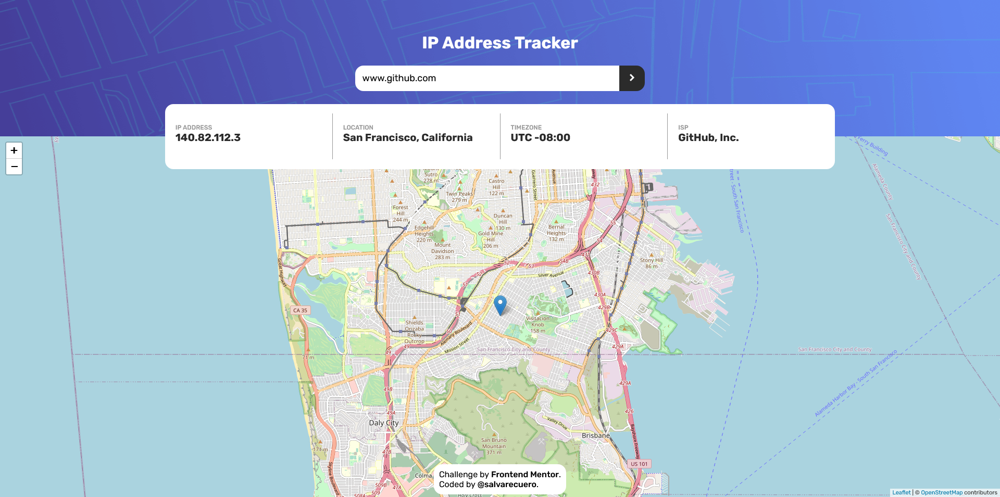

# Frontend Mentor - IP address tracker solution

This is a solution to the [IP address tracker challenge on Frontend Mentor](https://www.frontendmentor.io/challenges/ip-address-tracker-I8-0yYAH0).

## Table of contents

- [Overview](#overview)
  - [The challenge](#the-challenge)
  - [Screenshot](#screenshot)
  - [Links](#links)
- [My process](#my-process)
  - [Built with](#built-with)
- [Author](#author)

## Overview

### The challenge

Users should be able to:

- View the optimal layout for each page depending on their device's screen size
- See hover states for all interactive elements on the page
- See their own IP address on the map on the initial page load
- Search for any IP addresses or domains and see the key information and location

### Screenshot

### Links

- Solution URL: [https://www.frontendmentor.io/solutions/html-and-vanilla-css-flexbox-and-javascript-Ce2dy5yPx](https://www.frontendmentor.io/solutions/html-and-vanilla-css-flexbox-and-javascript-Ce2dy5yPx)
- Live Site URL: [https://salvarecuero.github.io/ip-address-tracker-challenge/](https://salvarecuero.github.io/ip-address-tracker-challenge/)

## My process

### Built with

- Semantic HTML5 markup
- CSS custom properties
- Flexbox
- Vanilla JavaScript
- Mobile-first workflow

## Author

- Website - [Salvador Recuero](https://salvador.vercel.app/)
- Frontend Mentor - [@salvarecuero](https://www.frontendmentor.io/profile/salvarecuero)
- GitHub - [salvarecuero](https://github.com/salvarecuero)
